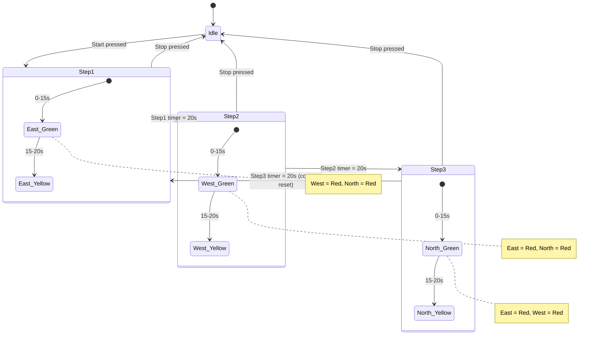

# Three-Way Junction Traffic Light Control System
### Siemens S7-1200 (TIA Portal) — PLC + HMI Automation Project

---

## 1. Project Summary

| | |
|---|---|
| **Project name** | Project48 – Three-Way Traffic Light Controller |
| **Controller** | Siemens SIMATIC S7-1200, CPU 1214C DC/DC/DC |
| **HMI** | Siemens SIMATIC TP700 Comfort |
| **Engineering software** | TIA Portal (Totally Integrated Automation Portal) |
| **Programming language** | Ladder Logic (LAD) |
| **Domain** | Discrete/sequential automation, traffic signal control |
| **Intersection type** | 3-way junction (North, East, West approaches) |

This project implements a cyclic, time-based traffic light controller for a
three-way (T-shaped) road junction. One approach is given a green phase at a
time while the other two are held at red; each active phase includes a green
period followed by a yellow clearance period before control passes to the
next approach. The sequence is fully automated by the PLC and can be
started/stopped from an HMI touch panel that also displays a live animated
view of the intersection.

---

## 2. Hardware & Software

- **PLC:** SIMATIC S7-1200, CPU 1214C DC/DC/DC
- **HMI Panel:** SIMATIC TP700 Comfort (7" touch panel)
- **Programming environment:** TIA Portal
- **Communication:** PLC–HMI connected via an internal HMI connection (PROFINET), tags mapped 1:1 between the two devices
- **I/O used:** 2 digital inputs (physical Start/Stop pushbuttons), 1 digital output reserved (expandable to real lamp outputs), remainder implemented as internal memory bits and mapped to the HMI

---

## 3. Control Concept

The intersection has three approaches — **North, East, West** — sharing a
single conflict point. The controller runs a fixed **3-step sequence**:

| Step | Active (Green) Direction | Directions Held Red |
|------|---------------------------|----------------------|
| STEP 1 | East | West, North |
| STEP 2 | West | East, North |
| STEP 3 | North | East, West |

Each step follows the same internal timing pattern, driven by a 20-second
timer (`TON`, PT = T#20s):

```
0s -------------------- 15s -------------------- 20s
|-------- GREEN --------|------- YELLOW ---------|
|<---   Active phase (Green + Yellow) = 20 s   -->|
```

- **0 s – 15 s:** active direction = **GREEN**, both other directions = **RED**
- **15 s – 20 s:** active direction = **YELLOW** (clearance), both other directions remain **RED**
- At 20 s the step timer completes, the sequencer advances to the next step, and the cycle repeats

One full cycle (Step 1 → Step 2 → Step 3 → Step 1 …) takes **60 seconds**
and repeats continuously as long as the system is in the `STARTED` state.

---

## 4. Program Architecture

All logic resides in **Main [OB1]**, organized into 8 networks plus 4 data
blocks:

| Block | Type | Purpose |
|---|---|---|
| `Main [OB1]` | Organization block | Cyclic program execution |
| `DB1 "STEP1"` | Instance DB (TON) | Step 1 phase timer |
| `DB2 "COUNTER_STEP"` | Instance DB (CTU) | Step sequencer / phase counter |
| `DB3 "STEP2"` | Instance DB (TON) | Step 2 phase timer |
| `DB4 "STEP3"` | Instance DB (TON) | Step 3 phase timer |

### Network 1 — Start/Stop Latch
An `SR` (Set-Reset) flip-flop implements the master run command:
- **S (Set):** `START(1)` (M0.0) → sets `STARTED` (M0.2)
- **R1 (Reset):** `STOP(1)` (M0.1) → resets `STARTED` (M0.2)

`STARTED` is the master enable used to gate all three phase timers, so the
whole sequence can be halted and restarted cleanly from the HMI.

### Network 2 — Step Sequencer
A `CTU` (Count Up) counter (`COUNTER_STEP`, DB2, PV = 3) tracks which step
is currently active via its `CV` (current value) output:
- **CU (count up):** triggered as Step 1 and Step 2 complete, advancing `CV` from 0 → 1 → 2
- **R (reset):** triggered as Step 3 completes, resetting `CV` back to 0 to restart the cycle

`COUNTER_STEP.CV` therefore acts as the **phase index**: `CV = 0` → Step 1
active, `CV = 1` → Step 2 active, `CV = 2` → Step 3 active.

### Networks 3–5 — Step 1 / Step 2 / Step 3 Timing
Each network is structurally identical, gated by `STARTED` AND the matching
`CV` value:
- A `TON` timer (`STEP1`/`STEP2`/`STEP3`, PT = T#20s) runs only while its step is active
- `ET < T#15s` drives the **Green** output for that step's active direction
- `T#15s < ET < T#20s` drives the **Yellow** output for that step's active direction
- The two non-active directions are held **Red** for the full duration of the step

### Networks 6–8 — Direction Output Mapping (EAST / WEST / NORTH)
Each physical direction has its final lamp state assembled by OR-ing the
contribution from whichever step currently controls it. For example
(Network 6, EAST):
- `EAST_GREEN` = `STEP1_EAST_GREEN`
- `EAST_RED` = `STEP2_EAST_RED` **OR** `STEP3_EAST_RED`
- `EAST_YELLOW` = `STEP1_EAST_YELLOW`

The same pattern is repeated for `WEST` (Network 7, sourced from Steps 1 & 3
for red, Step 2 for green/yellow) and `NORTH` (Network 8, sourced from Steps
1 & 2 for red, Step 3 for green/yellow). This decouples the "step logic"
from the "physical lamp logic," so each direction's three lamp tags are
driven by a single, unambiguous network.

---

## 5. PLC Tag List

**Default tag table**

| Name | Data type | Address |
|---|---|---|
| start | Bool | %I0.0 |
| stop | Bool | %I0.1 |
| Output | Bool | %Q0.0 |

**Tag table_1**

| Name | Address | Name | Address |
|---|---|---|---|
| START(1) | %M0.0 | STEP3_NORTH_GREEN | %M1.5 |
| STOP(1) | %M0.1 | STEP3_EAST_RED | %M1.6 |
| STARTED | %M0.2 | STEP3_WEST_RED | %M1.7 |
| STEP1_EAST_GREEN | %M0.3 | STEP3_NORTH_YELLOW | %M2.0 |
| STEP1_WEST_RED | %M0.4 | STEP3_FINISHED | %M2.1 |
| STEP1_NORTH_RED | %M0.5 | EAST_GREEN | %M2.2 |
| STEP1_EAST_YELLOW | %M0.6 | EAST_YELLOW | %M2.3 |
| STEP_1_FINISHED | %M0.7 | EAST_RED | %M2.4 |
| STEP2_WEST_GREEN | %M1.0 | NORTH_RED | %M2.5 |
| STEP2_EAST_RED | %M1.1 | NORTH_YELLOW | %M2.6 |
| STEP2_NORTH_RED | %M1.2 | NORTH_GREEN | %M2.7 |
| STEP2_WEST_YELLOW | %M1.3 | WEST_RED | %M3.0 |
| STEP2_FINISHED | %M1.4 | WEST_GREEN | %M3.1 |
| | | WEST_YELLOW | %M3.2 |

## 6. HMI Tag List (TP700 Comfort)

All HMI tags are bound 1:1 to the corresponding PLC tags above via the
`HMI_Connection` to `PLC_1`:

`EAST_GREEN`, `EAST_RED`, `EAST_YELLOW`, `NORTH_GREEN`, `NORTH_RED`,
`NORTH_YELLOW`, `WEST_GREEN`, `WEST_RED`, `WEST_YELLOW`, `START(1)`, `STOP(1)`

## 7. HMI Screen (Screen_1)

A single operator screen shows a top-down graphic of the T-junction with:
- Labeled **North**, **East**, **West** approaches with vehicle graphics
- Three-lamp traffic signal indicators per approach, animated live from the PLC tags
- **Start** and **Stop** push buttons that write to `START(1)` / `STOP(1)`

---

## 8. Sequence of Operation



---

## 9. Testing / Simulation

The program was developed and functionally verified in TIA Portal using
S7-PLCSIM (or online with a real CPU 1214C):
1. Download `PLC_1` and `HMI_1` configurations to the CPU / PLCSIM and the TP700 Comfort (or HMI simulator)
2. Press **Start** on the HMI — `STARTED` (M0.2) sets and Step 1 begins
3. Observe the 15 s green / 5 s yellow / red pattern cycling East → West → North
4. Press **Stop** at any time — `STARTED` resets and the sequence halts; pressing **Start** again resumes from Step 1

---


## 10. Known Limitations & Possible Improvements

This project is a strong demonstration of core S7-1200 ladder logic and
HMI integration skills, but the following points would need to be
addressed before it could be considered a production-grade traffic
controller:

- **No all-red safety interval** between phase changes — a dedicated
  1–2 s all-red clearance step between each green phase is standard
  practice in real signal controllers to guard against timing overlap.
- **Hard-coded timing values** (15 s / 20 s) — should be parameterized
  (e.g., in a data block or HMI recipe) so timings can be tuned without
  reprogramming.
- **No reusable function blocks (FBs)** — Steps 1–3 duplicate the same
  logic three times; this could be refactored into a single parameterized
  FB called with different instance data, which is standard practice for
  maintainable IEC 61131-3 code.
- **No fault/diagnostics handling** — no lamp-fault detection, no
  watchdog on the PLC-HMI link, no alarm/event logging.
- **No manual/maintenance mode or flashing-amber fallback** — real
  intersections default to a flashing-yellow/red mode on fault or manual
  override.
- **Purely time-based, not adaptive** — no vehicle detectors, induction
  loops, or pedestrian call buttons.
- **No safety/functional-safety consideration** (e.g., IEC 61508 / SIL
  requirements that apply to real traffic control systems).

---


## Author

Monish Senthil Kumar
M.Sc. Mechatronics, University of Siegen
[LinkedIn](https://linkedin.com/in/monish-senthil-kumar) · monish.skumar08@gmail.com
